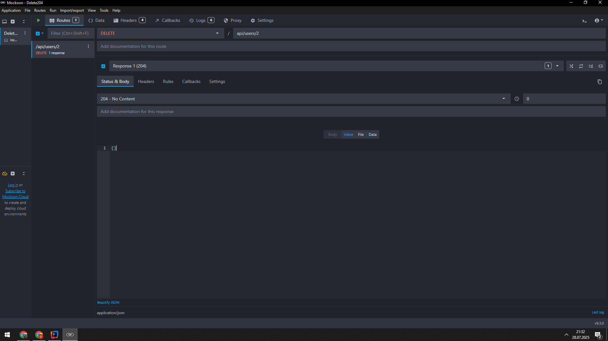

# APITests Maven Project

This project is designed to perform HTTP API tests using **Rest Assured** and **JUnit 5**.  
The test classes demonstrate how to validate HTTP 4xx and 5xx error codes.

---

## Project Overview

- Maven-based project.
- All dependencies are defined in the `pom.xml` file.
- Tests can be run using the `mvn test` command.
- Tests are performed against `jsonplaceholder.typicode.com` and a local Mockoon server.

---

## Requirements

- Java 24 must be installed.
- Maven must be installed and configured.
- A local Mockoon server must be running on **localhost:3000**.
    - Make sure Mockoon is properly configured with the endpoints required by the tests (e.g., **DELETE**, **POST**, etc.).
    - If these endpoints are missing or incorrectly set, some tests may fail or return unexpected results.
- Mockoon Interface
  - The interface of Mockoon is demonstrated in the image below:
    
   

---

## Running the Tests

Clone the repository:

```bash
git clone https://github.com/dogandagistanli/restassured-common-status-tests
```

Change into the project directory:

```bash
cd APITests
```

After cloning the repository, navigate to the project directory in your terminal and run:

```bash
mvn test
```
